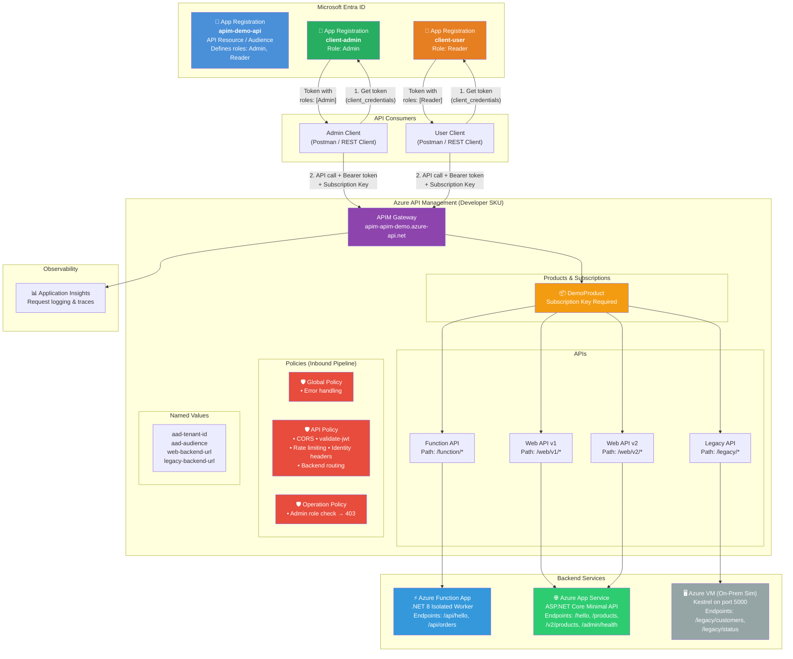
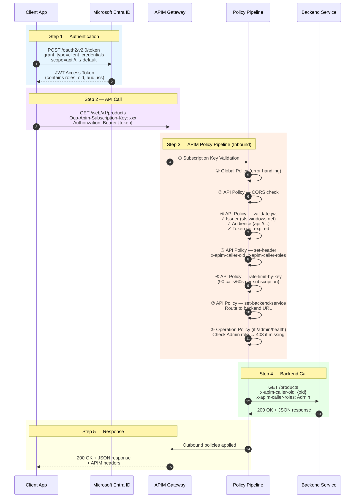
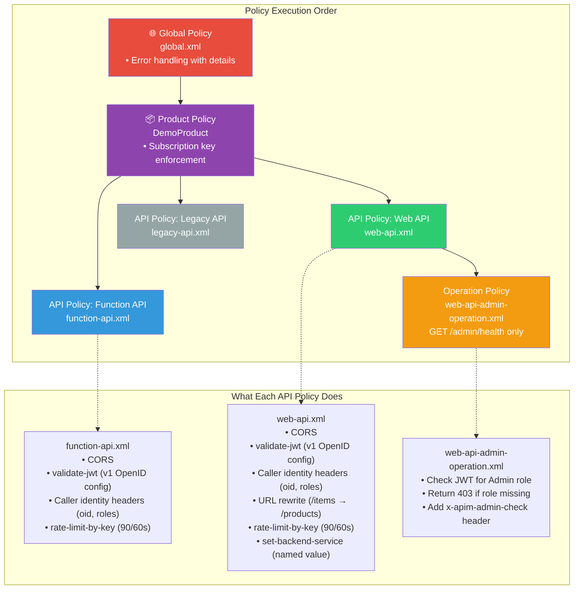

# APIM End-to-End Demo (Function + Web API + On-Prem Simulation)

This repo provides a complete demo that can be set up in under 2 hours and demonstrates:

1. Deploying a .NET 8 Azure Function App and .NET 8 App Service Web API
2. Securing both with Azure API Management (APIM)
3. OAuth2 client credentials with Microsoft Entra ID
4. APIM policies: rate limiting, validate-jwt, claims authZ, CORS, headers, rewrite, backend routing, error handling
5. APIM lifecycle: revisions (non-breaking) and versions (breaking)
6. Hybrid backend integration with an on-prem simulation (VM-hosted API)

---

## Architecture Overview



---

## Request Flow



---

## Entra ID App Registrations

Three app registrations are created to implement the OAuth2 client credentials flow with role-based access:

| App Registration | Purpose | Role Assigned | Token Contains |
|---|---|---|---|
| **`apim-demo-<suffix>-api`** | API Resource — defines the audience (`api://<appId>`) and app roles (`Admin`, `Reader`) | N/A (is the resource) | N/A |
| **`apim-demo-<suffix>-client-admin`** | Service principal for admin callers | `Admin` | `"roles": ["Admin"]` |
| **`apim-demo-<suffix>-client-user`** | Service principal for regular callers | `Reader` | `"roles": ["Reader"]` |

**How they work together:**

1. **API app** exposes an `api://` URI and declares two app roles: `Admin` and `Reader`
2. **Client-admin** is granted the `Admin` role on the API app → its `client_credentials` token contains `"roles": ["Admin"]`
3. **Client-user** is granted the `Reader` role → its token contains `"roles": ["Reader"]`
4. APIM's `validate-jwt` policy checks the token audience matches the API app
5. The operation policy on `/admin/health` checks for the `Admin` role in the JWT — returns **403** if missing

**Access Matrix:**

| Client | `/function/hello` | `/web/v1/products` | `/web/v1/admin/health` |
|---|---|---|---|
| **client-admin** (Admin) | ✅ 200 | ✅ 200 | ✅ 200 |
| **client-user** (Reader) | ✅ 200 | ✅ 200 | ❌ 403 |
| No token | ❌ 401 | ❌ 401 | ❌ 401 |
| No subscription key | ❌ 401 | ❌ 401 | ❌ 401 |

---

## APIM Policy Hierarchy

Policies execute in a layered hierarchy. Each layer calls `<base />` to inherit parent policies.



| Policy File | Scope | Key Features |
|---|---|---|
| `global.xml` | All APIs | Error handling — returns `context.LastError.Message` and `Reason` |
| `function-api.xml` | `/function/*` | CORS, JWT validation, caller claim headers, rate limiting |
| `web-api.xml` | `/web/v1/*` and `/web/v2/*` | CORS, JWT validation, URL rewrite, rate limiting, backend routing via named value |
| `legacy-api.xml` | `/legacy/*` | JWT validation, throttling, backend routing to VM |
| `web-api-admin-operation.xml` | `GET /admin/health` only | Checks `Admin` role in JWT, returns 403 if missing |

---

## Repository structure

```text
/README.md
/scripts
  00-prereqs-check.ps1
  01-provision-azure-resources.ps1
  02-deploy-function.ps1
  03-deploy-webapi.ps1
  04-provision-onprem-vm.ps1
  05-deploy-onprem-api.ps1
  06-configure-apim.ps1
  07-test-calls.ps1
  common.ps1
  env.sample
/src
  /FunctionApi
  /WebApi
  /LegacyApiSim
/apim
  /openapi
  /policies
/postman
  apim-demo.postman_collection.json
/docs
  architecture.md
  demo-talk-track.md
```

## Prerequisites

- Azure subscription with permission to create resources and app registrations
- Azure CLI (`az`) latest
- .NET SDK 8
- PowerShell 7+
- OpenSSH client (`ssh`, `scp`)
- Logged in to Azure CLI: `az login`

> APIM Developer SKU is used by default.

## Quick start

### 1) Prepare environment file

Copy sample env file:

```powershell
Copy-Item ./scripts/env.sample ./scripts/env.local
```

Edit `scripts/env.local` and set:

- `SUBSCRIPTION_ID`
- `TENANT_ID`
- `PUBLISHER_EMAIL`
- `PUBLISHER_NAME`

Optional:

- `LOCATION` (default: `eastus`)
- `NAME_PREFIX` (default: `apim-demo`)
- `UNIQUE_SUFFIX` (auto-generated when empty)
- SSH key paths for VM provisioning

### 2) Run provisioning and deployment scripts

From repo root:

```powershell
./scripts/00-prereqs-check.ps1
./scripts/01-provision-azure-resources.ps1
./scripts/02-deploy-function.ps1
./scripts/03-deploy-webapi.ps1
./scripts/04-provision-onprem-vm.ps1
./scripts/05-deploy-onprem-api.ps1
./scripts/06-configure-apim.ps1
```

This writes generated values to `scripts/.generated.env`.

### 3) Run test scenarios

```powershell
./scripts/07-test-calls.ps1
```

## What gets provisioned

- Resource group: `rg-apim-demo-<suffix>`
- Function App (Linux Consumption): `func-apim-demo-<suffix>`
- App Service Plan + Web App: `asp-...`, `web-...`
- APIM Developer instance: `apim-...`
- Application Insights: `appi-...`
- Key Vault: `kv-...`
- On-prem simulation networking and VM:
  - VNet: `onprem-vnet-<suffix>`
  - Subnet: `onprem-subnet`
  - NSG with inbound ports 22 and 5000
  - Ubuntu VM with Legacy API systemd service
- Entra app registrations:
  - API audience app (`api://<appId>`)
  - Admin client app (assigned `Admin` app role)
  - User client app (assigned `Reader` app role)

## APIs Exposed Through APIM

| API | Path | Backend | Type |
|---|---|---|---|
| Function API | `/function/*` | Azure Function App (.NET 8 Isolated) | Serverless |
| Web API v1 | `/web/v1/*` | App Service (ASP.NET Core Minimal API) | PaaS — versioned |
| Web API v2 | `/web/v2/*` | App Service (ASP.NET Core Minimal API) | PaaS — versioned |
| Legacy API | `/legacy/*` | VM on port 5000 (Kestrel) | IaaS — on-prem sim |

### Endpoints

- **Function API** (`/function/*`)
  - `GET /function/hello` — Hello message with timestamp
  - `GET /function/orders` — Sample orders array

- **Web API** — versioned using Segment versioning (v1/v2 are versions of the same API)
  - `GET /web/v1/hello` — Hello message
  - `GET /web/v1/products` — Products (v1 format: `id`, `name`, `price`)
  - `GET /web/v1/items` — Alias, rewritten to `/products` by APIM policy
  - `GET /web/v1/admin/health` — Health check (requires `Admin` role)
  - `GET /web/v2/products` — Products (v2 format: `sku`, `name`, `unitPrice`, `category`)

- **Legacy API** (`/legacy/*`) — requires VM to be running
  - `GET /legacy/customers` — Sample customer list
  - `GET /legacy/status` — Service status

## Security model

### Subscription + OAuth enforced

All APIs are added to `DemoProduct` with subscription required.

Clients must send both:

- `Ocp-Apim-Subscription-Key`
- `Authorization: Bearer <token>`

### OAuth2 / Entra ID

- API audience: `api://<API_APP_ID>`
- Token flow: client credentials
- App role claims used for APIM authorization policy:
  - `Admin`
  - `Reader`

### Token acquisition command examples

Load generated variables first:

```powershell
./scripts/common.ps1
Load-EnvFile -Path ./scripts/.generated.env
```

Get admin token:

```powershell
$tokenAdmin = Invoke-RestMethod -Method Post `
  -Uri "https://login.microsoftonline.com/$($env:TENANT_ID)/oauth2/v2.0/token" `
  -ContentType "application/x-www-form-urlencoded" `
  -Body @{
    client_id = $env:ADMIN_CLIENT_ID
    client_secret = $env:ADMIN_CLIENT_SECRET
    scope = "$($env:API_AUDIENCE)/.default"
    grant_type = "client_credentials"
  }
$tokenAdmin.access_token
```

Get user token:

```powershell
$tokenUser = Invoke-RestMethod -Method Post `
  -Uri "https://login.microsoftonline.com/$($env:TENANT_ID)/oauth2/v2.0/token" `
  -ContentType "application/x-www-form-urlencoded" `
  -Body @{
    client_id = $env:USER_CLIENT_ID
    client_secret = $env:USER_CLIENT_SECRET
    scope = "$($env:API_AUDIENCE)/.default"
    grant_type = "client_credentials"
  }
$tokenUser.access_token
```

## APIM Policies

Policy files are in `apim/policies/`. See the [Policy Hierarchy](#apim-policy-hierarchy) section above for the full diagram and execution order.

| File | Scope | Description |
|---|---|---|
| `global.xml` | All APIs | Error handling — surfaces `LastError.Message` and `Reason` |
| `function-api.xml` | Function API | CORS, JWT validation, caller identity headers, rate limiting |
| `web-api.xml` | Web API v1 & v2 | CORS, JWT validation, URL rewrite (`/items` → `/products`), rate limiting, backend routing |
| `legacy-api.xml` | Legacy API | JWT validation, throttling, backend routing to VM |
| `web-api-admin-operation.xml` | `GET /admin/health` | Operation-level Admin role check — returns 403 if missing |

## Key Vault + APIM Named Values

Script `06-configure-apim.ps1` creates named values and includes a Key Vault referenced named value (`kv-admin-client-secret`) using APIM Managed Identity.

Fallback (demo-only): if KV integration is blocked, store non-secret values via normal named values and keep secrets only in local env while testing.

## Test Scenarios and Expected Outcomes

Use `./scripts/07-test-calls.ps1`, `test/api-tests.http` (REST Client extension), or run manually.

| # | Scenario | Expected |
|---|---|---|
| 1 | No subscription key + no token | `401` |
| 2 | Subscription key + no token | `401` (JWT validation fails) |
| 3 | No subscription key + valid token | `401` (subscription required) |
| 4 | Admin token → `GET /function/hello` | `200` |
| 5 | Admin token → `GET /web/v1/products` | `200` |
| 6 | Admin token → `GET /web/v2/products` | `200` |
| 7 | Admin token → `GET /web/v1/admin/health` | `200` (Admin role present) |
| 8 | **User token** → `GET /web/v1/admin/health` | **`403`** (no Admin role) |
| 9 | Admin token → `GET /legacy/customers` | `200` (if VM running) or `502` |

### Testing with REST Client (Recommended)

Open `test/api-tests.http` in VS Code with the REST Client extension installed:

1. **Get tokens first** — click "Send Request" on the Admin Token and User Token requests
2. **Direct backend tests** — verify backends respond without APIM
3. **APIM tests** — test each API through the gateway with subscription key + bearer token
4. **Error cases** — verify 401/403 responses for missing credentials

## APIM lifecycle demo

### Revisions (non-breaking change)

Create revision 2 for `web-api` v1:

```powershell
./scripts/common.ps1
Load-EnvFile -Path ./scripts/.generated.env

az apim api revision create `
  --resource-group $env:RESOURCE_GROUP `
  --service-name $env:APIM_NAME `
  --api-id web-api `
  --api-revision 2 `
  --source-api-id web-api
```

Test revision endpoint by appending `;rev=2`:

- `https://<apim>.azure-api.net/web/v1;rev=2/products`

Promote revision to current:

```powershell
az apim api update --resource-group $env:RESOURCE_GROUP --service-name $env:APIM_NAME --api-id "web-api;rev=2" --is-current true
az apim api release create --resource-group $env:RESOURCE_GROUP --service-name $env:APIM_NAME --api-id "web-api;rev=2" --release-id "rev2-release" --notes "Promote revision 2"
```

### Versions (breaking change)

Already created by script using Segment versioning (version in URL path):

- v1: `/web/v1/products`
- v2: `/web/v2/products`

Both are versions of the **same API** linked via a version set (`web-api-versions`).

Breaking change example:

- v1 payload fields: `id`, `name`, `price`
- v2 payload fields: `sku`, `name`, `unitPrice`, `category`

## Hybrid backend integration

### Simple path (implemented)

- VM has public IP and APIM reaches it over HTTP 5000.
- Labeled demo-only and non-production.

### Enterprise path (optional)

Use one of these approaches:

1. APIM VNet mode + VNet peering to onprem-vnet
2. Self-hosted APIM gateway close to on-prem workloads
3. APIM private connectivity + VPN/ExpressRoute to private backend

Suggested hardening:

- Remove VM public IP
- Restrict NSG to private ranges
- Enforce TLS for backend

## Observability

Configured in script:

- APIM logger to Application Insights
- API diagnostics on function/web/legacy APIs

How to inspect:

1. Portal -> APIM -> APIs -> one API -> Diagnostics
2. Portal -> Application Insights -> Logs
3. Query failures (401/403) and correlate with `x-correlation-id`

Example KQL:

```kql
requests
| where cloud_RoleName contains "apim"
| project timestamp, name, resultCode, operation_Name, url, customDimensions
| order by timestamp desc
```

## Demo Script (Live Presentation Sequence)

1. **Architecture walkthrough** — show the Architecture Overview and Request Flow diagrams above
2. **Entra ID setup** — show the 3 app registrations in portal and explain API resource vs client apps
3. **APIM portal tour** — show APIs (Function API, Web API with v1/v2 versions, Legacy API), Product, and Subscription
4. **Policy walkthrough** — open policy editor, show the hierarchy: Global → API → Operation
5. **Live API testing** — open `test/api-tests.http` and run in order:
   - Get admin + user tokens
   - Direct backend calls (no APIM) — prove backends work
   - Function API through APIM — show JWT validation + identity headers
   - Web API v1 then v2 — show API versioning (Segment scheme)
   - Admin endpoint with admin token (200) then user token (403) — show RBAC
   - Error cases — missing key (401), missing token (401)
6. **Revision workflow** — create revision 2, test with `;rev=2`, promote to current
7. **Version comparison** — compare v1 vs v2 product payload schemas
8. **Observability** — show Application Insights logs, correlate with `x-correlation-id`
9. **Enterprise discussion** — cover private connectivity options (VNet, self-hosted gateway, VPN/ExpressRoute)

## Troubleshooting

- APIM provisioning is the longest step and may take 30-45 minutes.
- If Entra app role assignment fails due permissions, run script with an account that has App Registration admin rights.
- If APIM diagnostics command fails, configure diagnostics manually in portal and continue demo.
- If VM deployment fails over SSH key path, validate `SSH_PUBLIC_KEY_PATH` and `SSH_PRIVATE_KEY_PATH` in `env.local`.

## Cleanup

```powershell
./scripts/common.ps1
Load-EnvFile -Path ./scripts/.generated.env
az group delete --name $env:RESOURCE_GROUP --yes --no-wait
```
